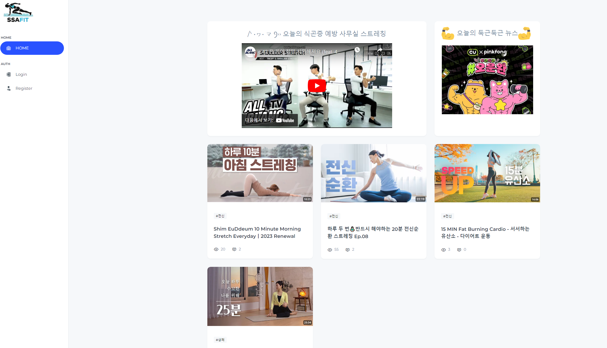
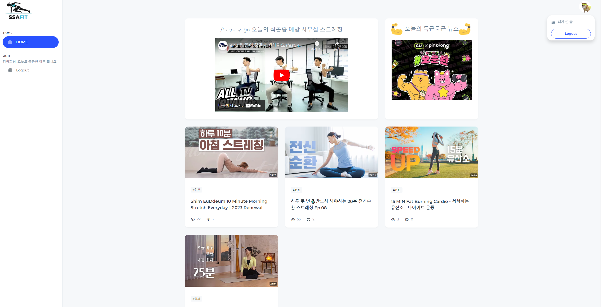
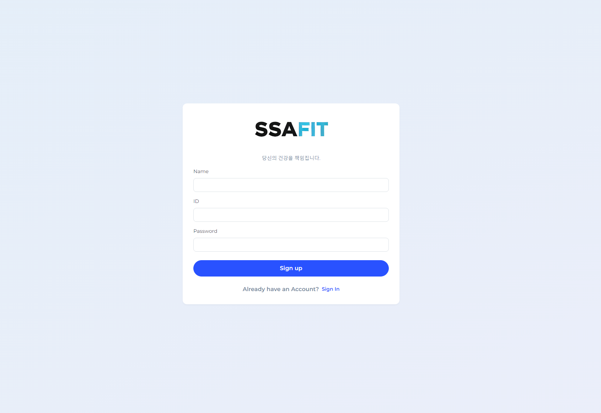
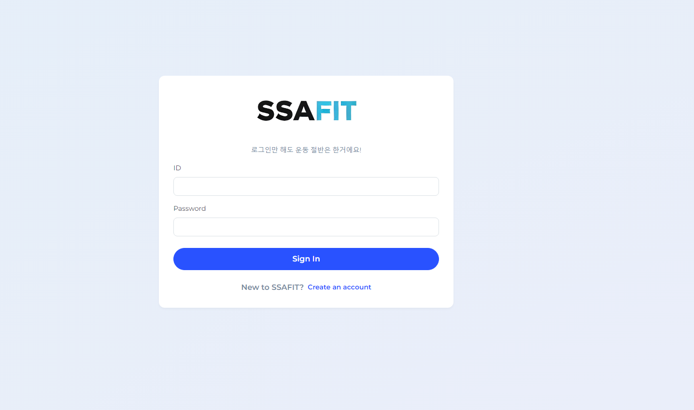
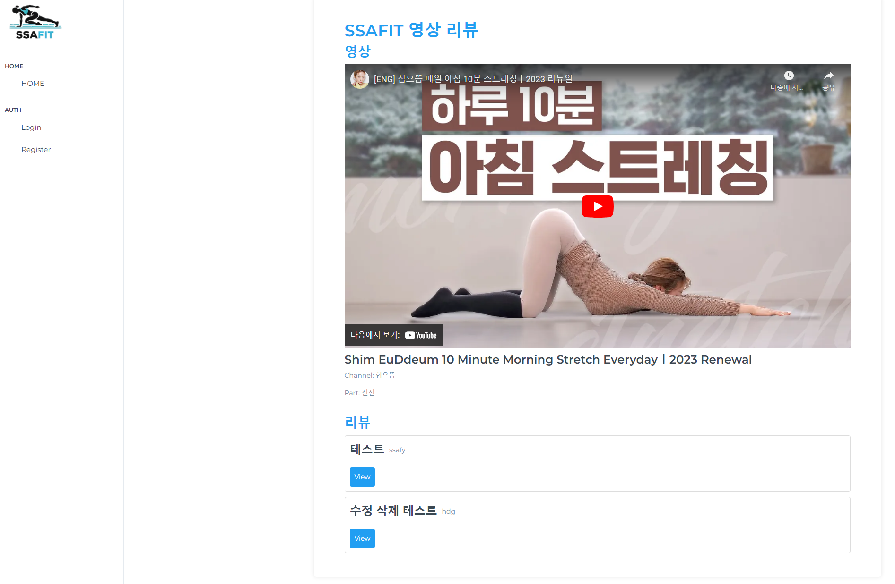
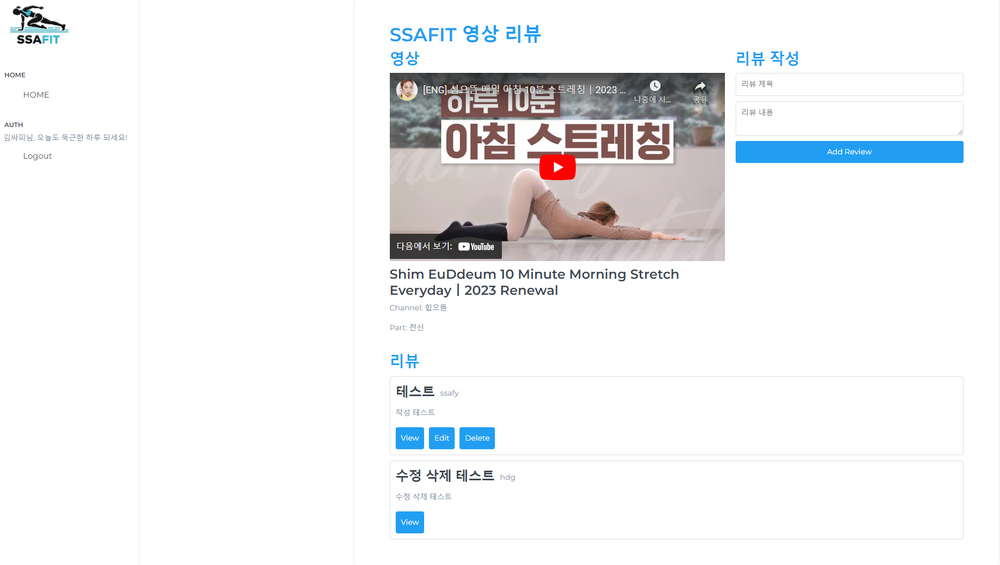
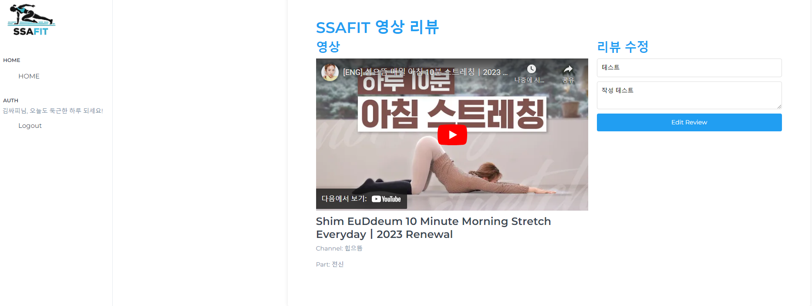
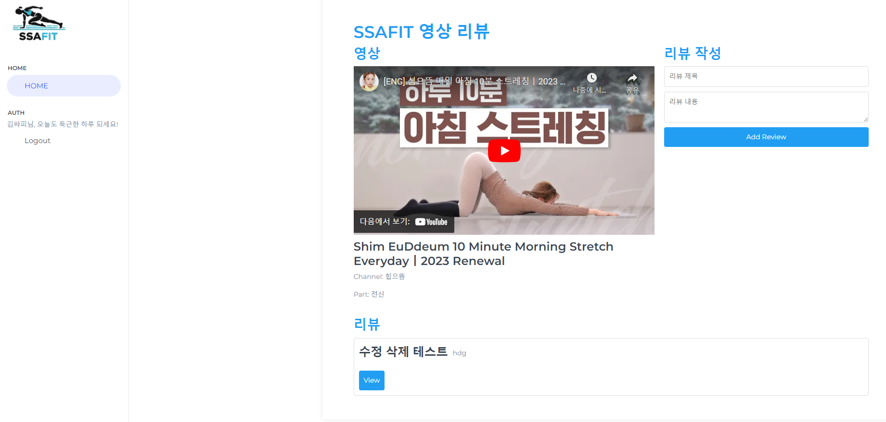
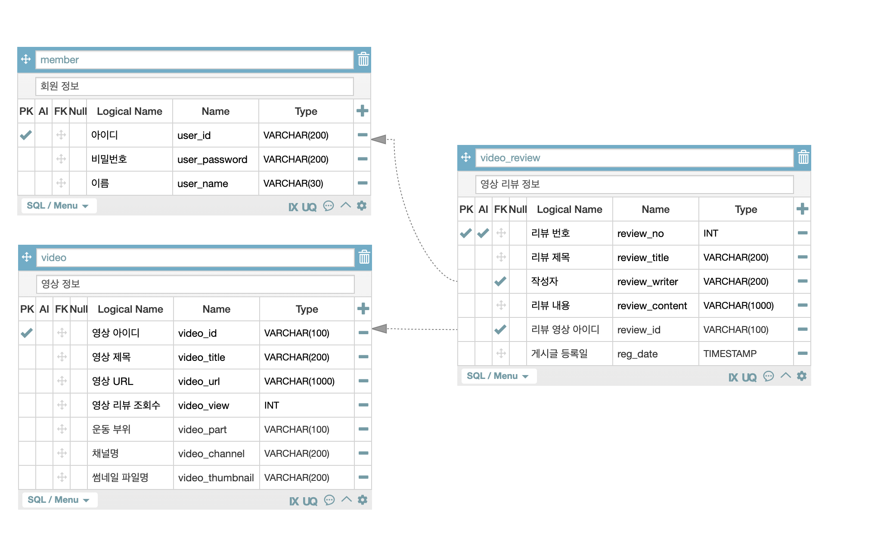

# Back & DB SSAFIT 관통프로젝트 1조 함동건, 김미나, 구민석

## 1. 홈화면
영상 목록을 DB에서 가져와서 썸네일과 운동부위, 조회수, 리뷰수를 보이게 하고 제목을 클릭하면 상세 리뷰페이지로 이동한다.

 


- ### 로그인 된 홈 화면
   
  
  
  
 ## 2. 로그인 / 회원가입
 - ### 홈화면 좌측에 Regist 버튼(회원가입)  
 
 	
- ### 홈화면 좌측에 login 버튼(로그인)  
 

## 3. 영상 시청 & 리뷰 페이지
- ### 홈 화면에서 영상 클릭 -> 영상 시청 가능, 리뷰 작성 가능한 페이지  
- ### 로그인 되지 않은 상태에서는 리뷰 작성이 뜨지 않는다.  
   

- ### View 버튼 - 리뷰 작성 내용을 볼 수 있다.
   
- ### Edit 버튼 - 로그인 된 사용자가 작성한 리뷰만 수정할 수 있다.  
 
- ### Delete 버튼 - 로그인 된 사용자가 작성한 리뷰만 삭제할 수 있다. 
 

## 4. DB
- ### DB ERDiagram
  

- ### DB Schema
```
create DATABASE ssafitdb;

use ssafitdb;

drop table video_review;
drop table video;
drop table member;

CREATE TABLE member (
	user_id VARCHAR(200) NOT NULL,
	user_password VARCHAR(200) NOT NULL,
	user_name VARCHAR(30) NOT NULL,
    PRIMARY KEY(user_id)
);

CREATE TABLE video (
	video_id VARCHAR(100) NOT NULL,	
	video_title VARCHAR(200) NOT NULL,
	video_url VARCHAR(1000) NOT NULL,
	video_view INT NOT NULL DEFAULT 0,
	video_part VARCHAR(100) NOT NULL,
	video_channel VARCHAR(200) NOT NULL,
    video_thumbnail VARCHAR(200) NOT NULL,
	PRIMARY KEY(video_id)
);

CREATE TABLE video_review (
	review_no INT NOT NULL AUTO_INCREMENT,
    review_title VARCHAR(200) NOT NULL,
    review_writer VARCHAR(200) NOT NULL,
    review_content VARCHAR(1000) NOT NULL,
    review_id VARCHAR(100) NOT NULL,
    reg_date TIMESTAMP DEFAULT CURRENT_TIMESTAMP,
    PRIMARY KEY (review_no),
    FOREIGN KEY (review_writer) REFERENCES member(user_id) on delete CASCADE,
    FOREIGN KEY (review_id) REFERENCES video(video_id) on delete CASCADE
);


select * from video;
select * from video_review;
select * from member;


insert into video (video_id, video_title, video_url, video_part, video_channel, video_thumbnail)
values ("video1", "Shim EuDdeum 10 Minute Morning Stretch Everydayㅣ2023 Renewal", "50WCSpZtdmA?si=Hj9GPxwN25BInD5h", "전신", "힙으뜸" , "work1.png"),
("video2", "하루 두 번🧘🏻‍♀️반드시 해야하는 20분 전신순환 스트레칭 Ep.08", "Kk7TQGqQ3nA?si=ZfHW53BgByvekSml", "전신","빵느", "work2.png"),
("video3", "15 MIN Fat Burning Cardio - 서서하는 유산소 - 다이어트 운동", "02K-k6daPb4?si=DXo7GQSWTk9d3U1M", "전신","빅씨스 Bigsis", "work3.png"),
("video4", "뭉친 어깨, 뻣뻣한 골반 풀어주는 요가 | 앉아서 하는 요가 스트레칭 | 어깨 근육 풀기, 골반풀기", "D3yExRi7EME?si=PSj-OM2hzJMQesiQ", "상체","Mindful Yoga with Eileen", "work4.png");

insert into member (user_id, user_password, user_name)
values ("ssafy", "1234", "김싸피"),
("kms", "1234", "구민석");

insert into video_review (review_title, review_writer, review_content, review_id)
values ("테스트", "ssafy", "리뷰 작성 테스트", "video1");

```


