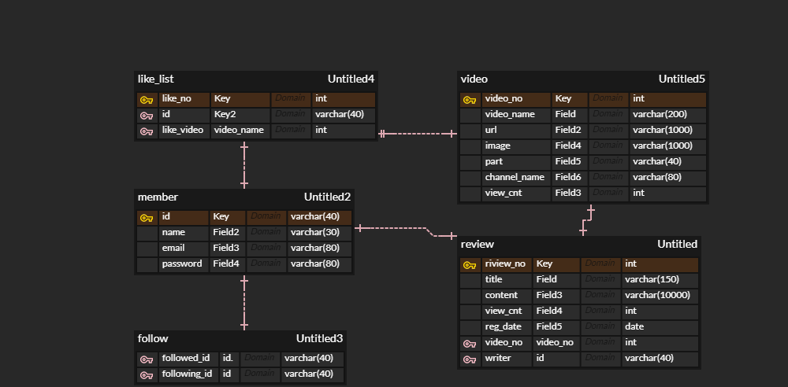

# BackEnd + DB 관통 프로젝트

## 1. 기본 기능
메인화면
 - 로그인을 하지 않았을 때 네비게이션 바에 로그인과 회원가입 버튼만 표시
 - 로그인을 했을 경우 네비게이션 바에 마이페이지와 로그아웃 버튼 표시
 - 로그인 했을 경우 영상 하단에 리뷰 버튼과 찜 버튼 생성
 - 메인 화면의 상단에 조회수 기준 상위 6개 영상 나열
 - 메인 화면의 하단에는 모든 영상 나열


리뷰 게시판
 - 글 작성 가능
 - 제목으로 리뷰 검색 가능
 - 영상에 대한 리뷰 목록 나열
 - 영상에 대한 조회수 표시
 - 리뷰 제목을 누르면 리뷰에 대한 상세사항 표시
 !(./image/게시판메인.png)

리뷰 게시판 상세
 - 게시물 번호, 제목, 작성자, 내용, 조회수 표시
 - 본인이 작성한 리뷰에 대해서만 수정, 삭제버튼 활성화
 
 

회원가입 기능
 - 아이디, 비밀번호, 이름, 이메일을 입력받아 회원가입 가능
 - 회원가입이 성공했을 경우 바로 로그인 화면으로 연결
 

로그인 기능
 - 아이디와 비밀번호를 입력했을 때 DB에 저장되어 있는 아이디 비밀번호와 일치할 경우 로그인 성공
  

## 2. 추가 기능
조회수에 따른 영상 목록 조회
 - 메인 화면의 상단에 영상의 조회수 기준으로 상위 6개 영상 나열
 

팔로우 기능
 - 리뷰 게시판 화면에서 작성자 옆에 있는 팔로우 버튼을 누르면 팔로우 가능
 - 로그인한 정보와 작성자가 다를 경우에만 팔로우버튼 활성화


영상 찜 기능
 - 메인화면에서 영상 하단의 찜 버튼을 누를 경우 찜 목록에 추가

마이페이지
 - 마이페이지에서 팔로우 목록과 찜 목록 확인 가능
 - 각 항목에 대해 삭제 기능, 전체 목록 삭제 기능


## 3. 심화 기능
리뷰 제목 검색 기능
 - 리뷰 게시판 화면에서 입력한 단어를 포함하는 제목을 가진 리뷰 검색 가능


### DB 설계

```
DROP DATABASE IF EXISTS ssafit_prj;

CREATE DATABASE IF NOT EXISTS ssafit_prj;

USE ssafit_prj;

CREATE TABLE IF NOT EXISTS member (
    id VARCHAR(40),
    name VARCHAR(30) NOT NULL,
    email VARCHAR(80) UNIQUE,
    password VARCHAR(80) NOT NULL,
    PRIMARY KEY(id)
);

CREATE TABLE IF NOT EXISTS video (
	video_no INT AUTO_INCREMENT,
    video_name VARCHAR(200) UNIQUE NOT NULL, 
    url VARCHAR(1000) NOT NULL,
    image VARCHAR(1000),
    part VARCHAR(40) NOT NULL,
    channel_name VARCHAR(80) NOT NULL,
    view_cnt INT DEFAULT 0,
    PRIMARY KEY(video_no)
);

CREATE TABLE IF NOT EXISTS review (
	review_no INT AUTO_INCREMENT,
    video_no INT,
    title VARCHAR(150) NOT NULL,
    writer VARCHAR(40) NOT NULL,
    content VARCHAR(10000) NOT NULL,
    view_cnt INT DEFAULT 0,
    reg_date DATETIME DEFAULT CURRENT_TIMESTAMP,
    FOREIGN KEY (writer) REFERENCES member(id) ON DELETE CASCADE,
    FOREIGN KEY (video_no) REFERENCES video(video_no) ON DELETE CASCADE,
    PRIMARY KEY(review_no)
);

CREATE TABLE IF NOT EXISTS follow (
	followed_id VARCHAR(40),
    following_id VARCHAR(40),
    FOREIGN KEY (following_id) REFERENCES member(id) ON DELETE CASCADE,
    FOREIGN KEY (followed_id) REFERENCES member(id) ON DELETE CASCADE
);

CREATE TABLE IF NOT EXISTS like_list (
	like_no INT AUTO_INCREMENT,
    id VARCHAR(40),
    like_video VARCHAR(200),
    PRIMARY KEY(like_no),
    FOREIGN KEY (id) REFERENCES member(id) ON DELETE CASCADE,
    FOREIGN KEY (like_video) REFERENCES video(video_name) ON DELETE CASCADE
);
```
