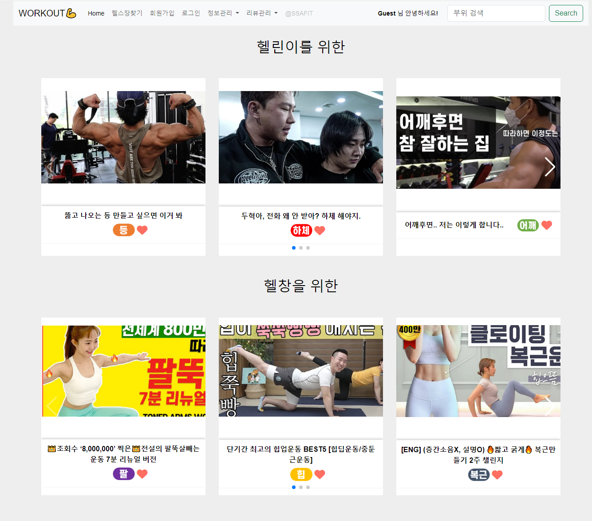
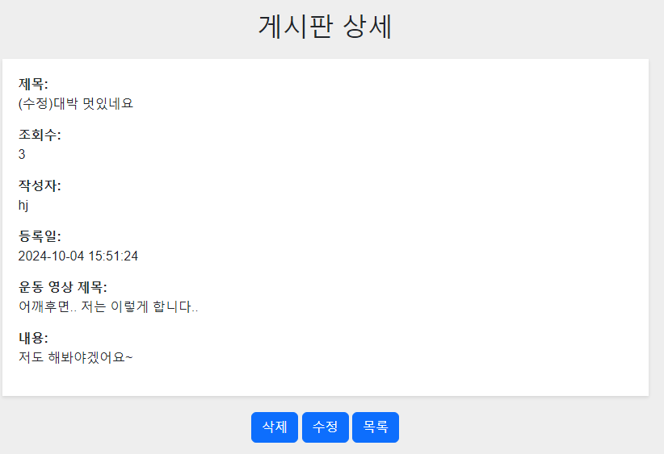
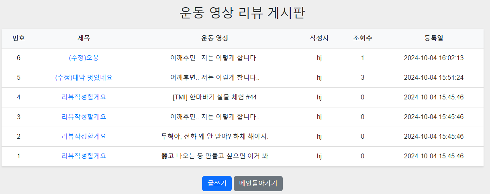

## 프로젝트에 대한 설명과 구현한 페이지 정보를 작성, 기능 구현된 화면을 캡처한 이미지(jpg, gif 등등)

### 메인화면
- 로그인 되지 않은 상태에서는 상단 바에 '회원 가입' 및 '로그인'이 표시되고, Guest로 표시된다



- 로그인 후에는 상단 바에 '로그아웃'이 표시되고, 가입자 이름으로 표시된다


### 회원가입
- 미작성 후 제출할 경우 알림창이 뜬다 


- 회원정보 중복 시 중복가입이 되지 않도록 한다.


- 회원 가입 성공 시 알림창이 뜨고, 로그인 페이지로 이동한다


- 취소 버튼 누를 시 알림창이 뜨고 메인 페이지로 이동한다


- 회원가입 시 DB에 멤버 정보 저장


### 로그인
- db에 등록된 id와 pw가 맞지 않을 경우 잘못되었다는 알림창 호출


### 로그아웃
- 로그아웃 시 알림창 호출


### 리뷰작성
- 로그인 했을 때 리뷰 작성하면 작성자 id가 고정으로 적용


- 로그인 하지 않았을 때 작성 시 작성 안되도록 구현


- 운동 영상 선택하지 않았을 때


### 리뷰보기
- 리뷰 등록했을 때 db에 등록된 결과


- 홈페이지상 리뷰 게시판


### 리뷰 디테일
- 작성한 리뷰 조회시 조회수 증가, 등록일 정상 업로드


- 수정 시 상세 화면





### 메인페이지의 이미지를 누를 때 해당 동영상의 리뷰만 띄워짐


## ER Diagram


## DB Schema(DDL-SQL 파일)

```sql
create database prj_be;
desc board;
desc video;
use prj_be;

select * from board;
select * from member;
select * from video;
drop table MEMBER;
drop table BOARD;
drop table VIDEO;
drop table MEMBER;
drop table WISHLIST;
drop table BODY_TARGET;
drop table images;

desc VIDEO;

CREATE TABLE VIDEO (
    VIDEO_ID INT AUTO_INCREMENT PRIMARY KEY,
    VIDEO_TITLE VARCHAR(1000) NOT NULL,
    VIDEO_LINK VARCHAR(1000) NOT NULL,
    VIDEO_PATH VARCHAR(1000),
    VIDEO_TARGET VARCHAR(50),
    VIDEO_level VARCHAR(30),
    VIDEO_TARGET_PATH VARCHAR(30)
);

CREATE TABLE BOARD (
    REVIEW_NO INT AUTO_INCREMENT,  -- 시스템이 자동 증가 되게 설정
    REVIEW_TITLE VARCHAR(300) NOT NULL,  -- 입력이 무조건 필요
    REVIEW_CONTENT VARCHAR(1000) NOT NULL,
    REVIEW_VIEW_CNT INT DEFAULT 0,
    REVIEW_REG_DATA TIMESTAMP DEFAULT CURRENT_TIMESTAMP,  -- 등록 시간: 등록 시 현재 시간으로 설정
    MEMBER_ID VARCHAR(50) NOT NULL,  -- MEMBER 테이블의 MEMBER_ID 참조
    VIDEO_ID INT,  -- VIDEO 테이블의 VIDEO_ID 참조
    PRIMARY KEY(REVIEW_NO),  -- REVIEW_NO 고유키 설정
    FOREIGN KEY (MEMBER_ID) REFERENCES MEMBER(MEMBER_ID) ON DELETE CASCADE,  -- MEMBER 테이블의 MEMBER_ID를 참조하는 외래 키 (탈퇴 시 게시글 삭제)
    FOREIGN KEY (VIDEO_ID) REFERENCES VIDEO(VIDEO_ID) ON DELETE CASCADE -- VIDEO 테이블의 VIDEO_ID를 참조하는 외래 키
);

CREATE TABLE MEMBER (
    MEMBER_ID VARCHAR(50),
    MEMBER_NAME VARCHAR(50) NOT NULL,
    MEMBER_EMAIL VARCHAR(100) NOT NULL,
    MEMBER_PASSWORD VARCHAR(100) NOT NULL,
    PRIMARY KEY(MEMBER_ID)
);

CREATE TABLE WISHLIST (
    WISHLIST_ID INT AUTO_INCREMENT,
    VIDEO_ID INT,
    MEMBER_ID VARCHAR(50),
    WISHLIST_REG_DATE TIMESTAMP DEFAULT CURRENT_TIMESTAMP,
    PRIMARY KEY(WISHLIST_ID),
    FOREIGN KEY (VIDEO_ID) REFERENCES VIDEO(VIDEO_ID) ON DELETE CASCADE,
    FOREIGN KEY (MEMBER_ID) REFERENCES MEMBER(MEMBER_ID) ON DELETE CASCADE  
);

INSERT INTO VIDEO(VIDEO_TITLE, VIDEO_LINK, VIDEO_PATH,VIDEO_TARGET, video_level,VIDEO_TARGET_PATH) 
VALUES("뚫고 나오는 등 만들고 싶으면 이거 봐", '<iframe width="560" height="315" src="https://www.youtube.com/embed/8SBBp65Sv3c?si=EM14NLqyy0IyyLSA" title="YouTube video player" frameborder="0" allow="accelerometer; autoplay; clipboard-write; encrypted-media; gyroscope; picture-in-picture; web-share" referrerpolicy="strict-origin-when-cross-origin" allowfullscreen></iframe>',"img/img1.png","등","easy","img/등.png"),
("두혁아, 전화 왜 안 받아? 하체 해야지.", '<iframe width="560" height="315" src="https://www.youtube.com/embed/zwTZfUfxRA0?si=-ycFC45PlD76dK-l" title="YouTube video player" frameborder="0" allow="accelerometer; autoplay; clipboard-write; encrypted-media; gyroscope; picture-in-picture; web-share" referrerpolicy="strict-origin-when-cross-origin" allowfullscreen></iframe>',"img/img2.png","하체","easy","img/하체.png"),
("어깨후면.. 저는 이렇게 합니다..", '<iframe width="560" height="315" src="https://www.youtube.com/embed/HCnDDAMDKps?si=SGmbdGnpsH2X5S0i" title="YouTube video player" frameborder="0" allow="accelerometer; autoplay; clipboard-write; encrypted-media; gyroscope; picture-in-picture; web-share" referrerpolicy="strict-origin-when-cross-origin" allowfullscreen></iframe>',"img/img3.png","어깨","easy","img/어깨.png"),
("[TMI] 한마바키 실물 체험 #44", '<iframe width="560" height="315" src="https://www.youtube.com/embed/zVwi6hstFnA?si=OkrJ78LxeLzPSDU5" title="YouTube video player" frameborder="0" allow="accelerometer; autoplay; clipboard-write; encrypted-media; gyroscope; picture-in-picture; web-share" referrerpolicy="strict-origin-when-cross-origin" allowfullscreen></iframe>',"img/img4.png","복근","easy","img/복근.png"),
("동탄왕팔 만든 솔로 이두 운동", '<iframe width="560" height="315" src="https://www.youtube.com/embed/ONJ-3U3JpUI?si=J1vvJ-Az6SYvrsid" title="YouTube video player" frameborder="0" allow="accelerometer; autoplay; clipboard-write; encrypted-media; gyroscope; picture-in-picture; web-share" referrerpolicy="strict-origin-when-cross-origin" allowfullscreen></iframe>',"img/img5.png","팔","easy","img/팔.png"),
("👑조회수 ‘8,000,000’ 찍은👑전설의 팔뚝살빼는운동 7분 리뉴얼 버전", '<iframe width="560" height="315" src="https://www.youtube.com/embed/JsF2nzetLBU?si=aZcUnQj7xcRTLkFE" title="YouTube video player" frameborder="0" allow="accelerometer; autoplay; clipboard-write; encrypted-media; gyroscope; picture-in-picture; web-share" referrerpolicy="strict-origin-when-cross-origin" allowfullscreen></iframe>',"img/img_easy1.png","팔","hard","img/팔.png"),
("단기간 최고의 힙업운동 BEST5 [힙딥운동/중둔근운동]", '<iframe width="560" height="315" src="https://www.youtube.com/embed/oB-PmMdKAVA?si=d1ds4TaC-thPCVzZ" title="YouTube video player" frameborder="0" allow="accelerometer; autoplay; clipboard-write; encrypted-media; gyroscope; picture-in-picture; web-share" referrerpolicy="strict-origin-when-cross-origin" allowfullscreen></iframe>',"img/img_easy2.png","힙","hard","img/힙.png"),
("[ENG] (층간소음X, 설명O) 🔥짧고 굵게🔥 복근만들기 2주 챌린지", '<iframe width="560" height="315" src="https://www.youtube.com/embed/QSZ0mUGO_CA?si=hBmZWQyuyVMzS9Mg" title="YouTube video player" frameborder="0" allow="accelerometer; autoplay; clipboard-write; encrypted-media; gyroscope; picture-in-picture; web-share" referrerpolicy="strict-origin-when-cross-origin" allowfullscreen></iframe>',"img/img_easy3.png","복근","hard","img/복근.png"),
("1분만에 라운드숄더 교정이 가능할까? ｜어깨 소흉근 스트레칭｜자생한방병원", '<iframe width="560" height="315" src="https://www.youtube.com/embed/AQlQSx4fq4o?si=T3-EjQR-8Qla6Asq" title="YouTube video player" frameborder="0" allow="accelerometer; autoplay; clipboard-write; encrypted-media; gyroscope; picture-in-picture; web-share" referrerpolicy="strict-origin-when-cross-origin" allowfullscreen></iframe>',"img/img_easy4.png","어깨","hard","img/어깨.png"),
("하체 날, 딱 10분 밖에 없다면 - 스쿼트 10가지 동작 - 하체운동 홈트 루틴", '<iframe width="560" height="315" src="https://www.youtube.com/embed/DWYDL-WxF1U?si=nAvRSoH99Afr27kb" title="YouTube video player" frameborder="0" allow="accelerometer; autoplay; clipboard-write; encrypted-media; gyroscope; picture-in-picture; web-share" referrerpolicy="strict-origin-when-cross-origin" allowfullscreen></iframe>',"img/img_easy5.png","하체","hard","img/하체.png");

insert into member(member_id, member_name, member_email, member_password)
values("hj", "김혜준", "hj@naver.com","1234");

insert into board(review_title, review_content, member_id, video_id)
values("리뷰작성할게요", "내용", "hj", 1),
("리뷰작성할게요", "내용", "hj", 2),
("리뷰작성할게요", "내용", "hj", 3),
("리뷰작성할게요", "내용", "hj", 4),
("리뷰작성할게요", "내용", "hj", 5);

select VIDEO_ID, VIDEO_TITLE, VIDEO_LINK, VIDEO_PATH, VIDEO_TARGET , VIDEO_LEVEL, VIDEO_TARGET_PATH from video where VIDEO_ID = 3;

select * from member;
select * from board;
select * from video;
select VIDEO_ID, VIDEO_TITLE, VIDEO_LINK, VIDEO_PATH, VIDEO_TARGET, VIDEO_LEVEL from video where video_level = 'hard' order by VIDEO_ID desc;
```

## 파일트리


