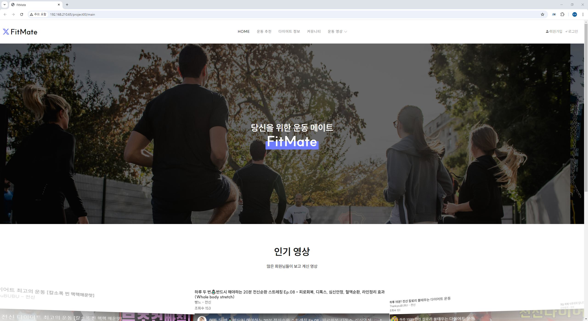
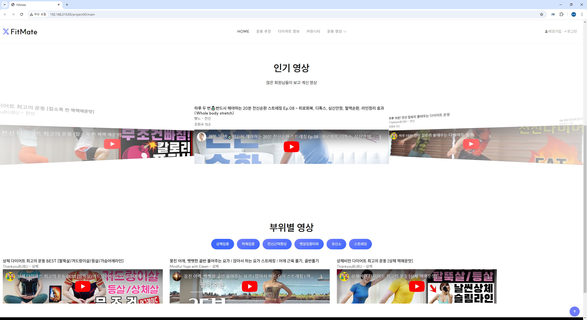
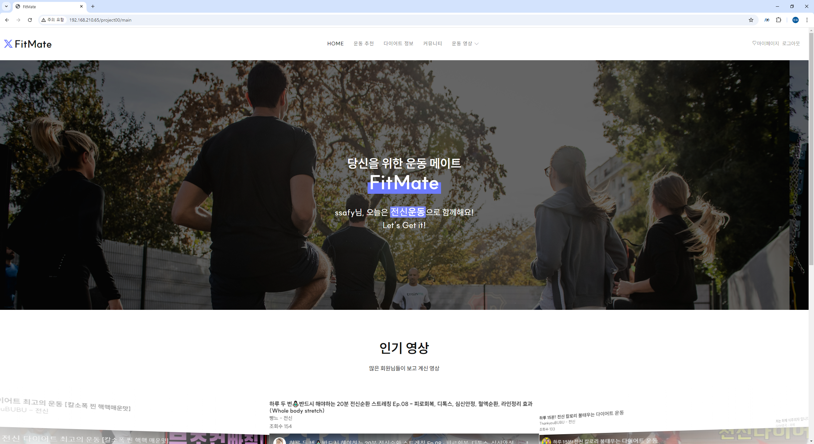
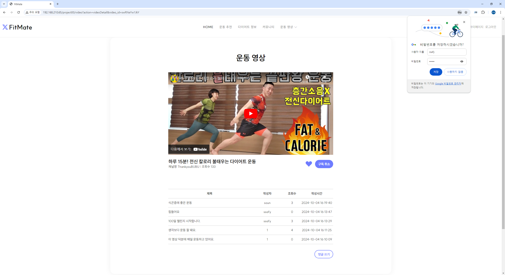
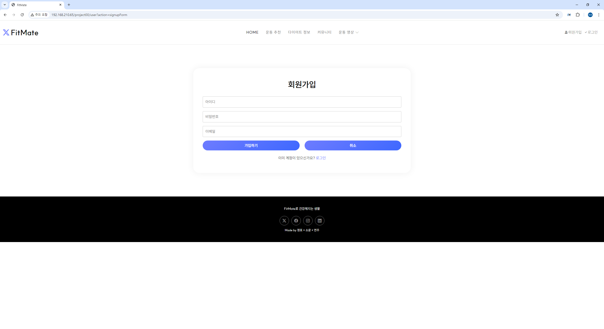
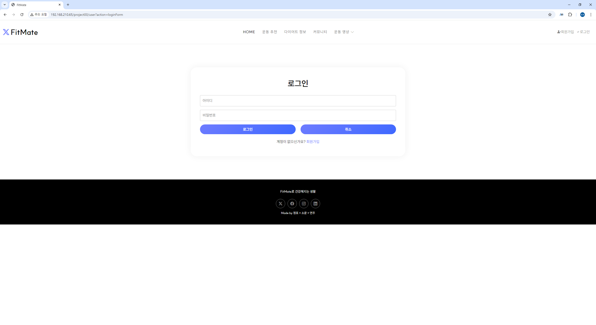
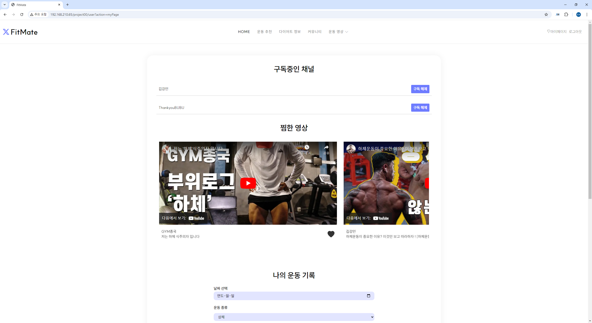
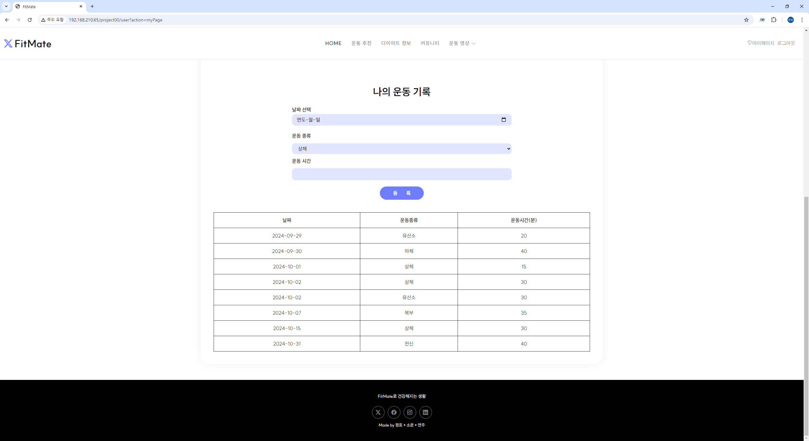

# 4조 Back+DB 관통 프로젝트 결과 보고

## 1. 페이지 간단 소개
### 운동 영상을 제공하고 개인 맞춤형 운동 추천을 해주는 웹 플랫폼

## 2. 구현한 기능
### 1. 기본 기능
### (1) 메인 페이지
 - 조회수 기준 영상, 운동 부위별 영상
 
### (2) 운동 영상에 대한 리뷰 관리 백엔드 구현
- 리뷰 목록, 등록, 수정, 상세, 삭제
- 리뷰 글자수 세기 및 지정된 글자수를 넘기면 경고와 함께 추가 입력 불가
- 로그인하지 않고 리뷰 등록 시도 시, 로그인 창으로 이동

### 2. 추가 기능
### (1) 회원 가입, 로그인, 로그아웃
- 로그인 실패 시 알림창 구현
- 로그인 / 회원가입 서로 페이지 이동 가능

### 3. 심화 기능
### (1) 찜 및 찜한 영상 추가 / 삭제
- 만약 찜한 영상이 없을 경우, “찜한 영상이 없습니다” 문구 출력
- 영상 상세 화면에서 찜 버튼 토글 작동
- 마이 페이지에서  확인 가능
- 로그인하지 않고 찜 버튼 누를 시, 로그인 창으로 이동

### (2) 채널 구독 시스템
- 만약 구독 채널이 없을 경우, “구독한 채널이 없습니다” 문구 출력
- 영상 상세 화면에서 구독 버튼 토글 작동
- 마이 페이지에서  확인 가능
- 로그인하지 않고 구독 버튼 누를 시, 로그인 창으로 이동

### (3) [추가] 사용자별 일주일 동안 부족한 운동 종류 추천
- 로그인 시 사용자가 입력한 지난 일주일간의 운동 데이터를 바탕으로,  부족한 운동 종류를 알려주고,  해당 종류의 운동을 진행하도록 유도 (클릭 시 섹션 이동)
- 로그인 시 ‘메인에 오늘은 00 운동 어떠세요?’ 라는 문구가 보이도록
- 입력한 데이터가 없을 경우에는 입력을 유도하는 문구 보여짐
- 사용자 입력 데이터 : 운동한 날짜, 운동 종류, 운동 시간

## 3. 구현한 화면
### 1. 메인 페이지 

### 2. 영상 상세페이지

### 3. 회원가입 / 로그인

### 4. 마이 페이지 

