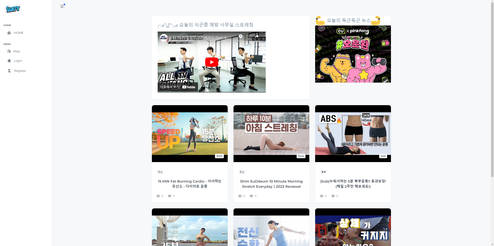
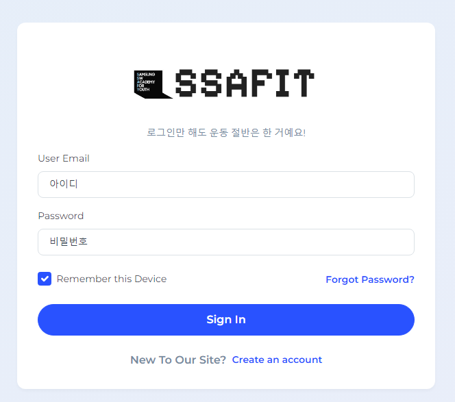
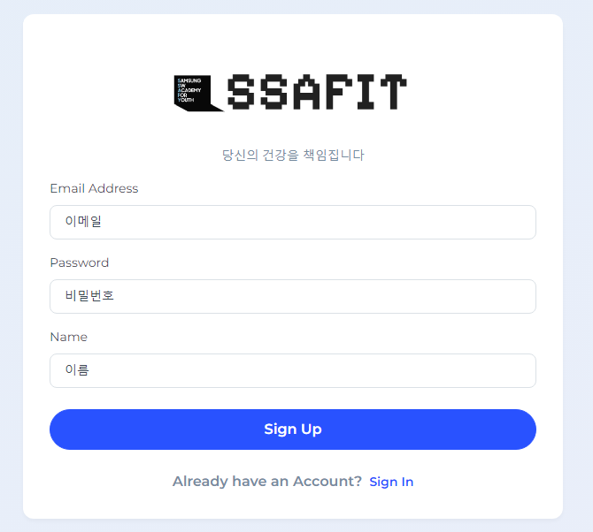
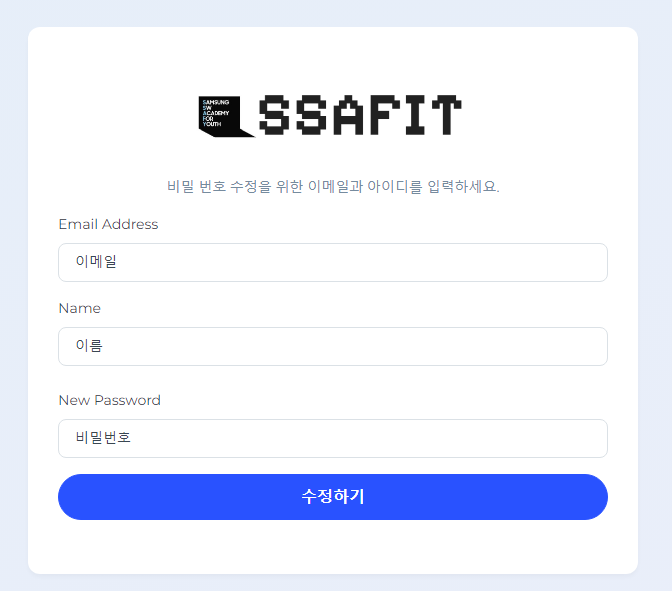
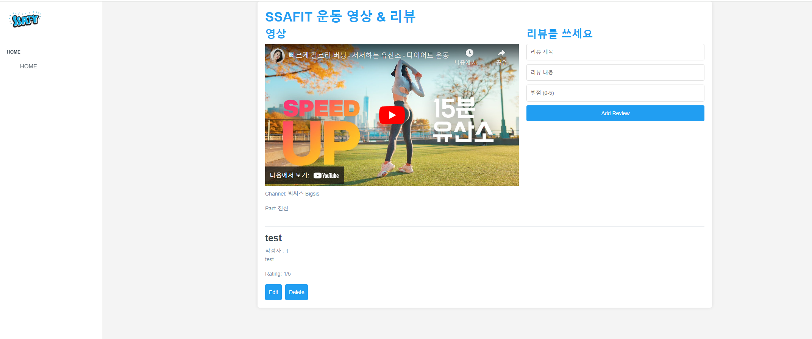
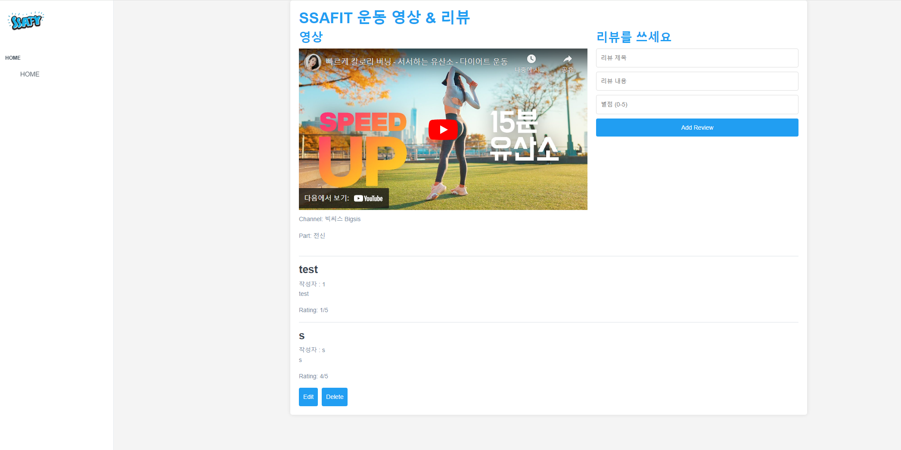
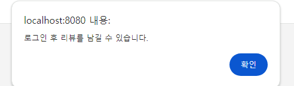
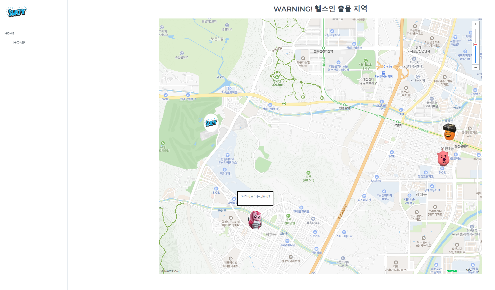
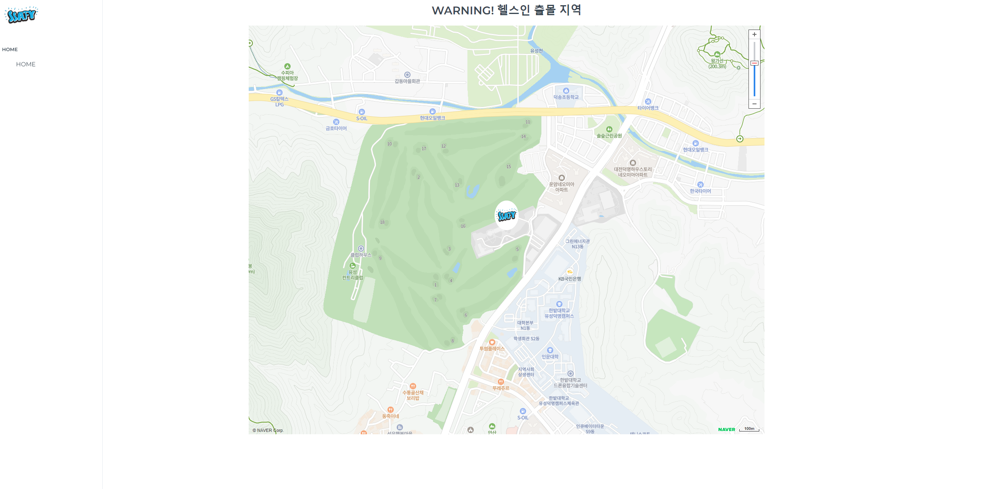
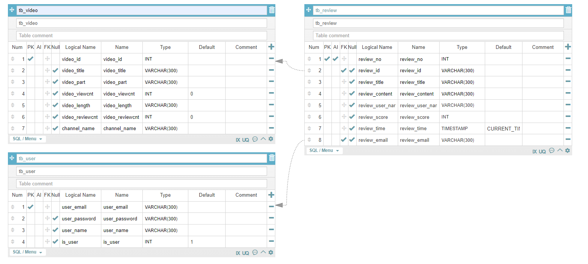

# 프로젝트 유승호 배한진
## 목표
  FrontEnd 프로젝트에서 작성한 코드에 BackEnd 기능을 구현
## 화면 
  ### 메인화면
  
  메인 페이지.
## 회원
  ### 회원가입
  
  ### 로그인
  
  ### 비밀번호변경
     
  이메일과 이름이 같아야 비밀번호를 바꿀 수 있다.   
## 게시물
  ### 리뷰
  
  
  해당 댓글을 작성한 사람만 수정 삭제를 할 수 있다.   
     
  로그인 한 경우만 댓글을 남길 수 있다.   
## 부가기능
  ### 지도 살펴보기
  
  
## dbtable
  
